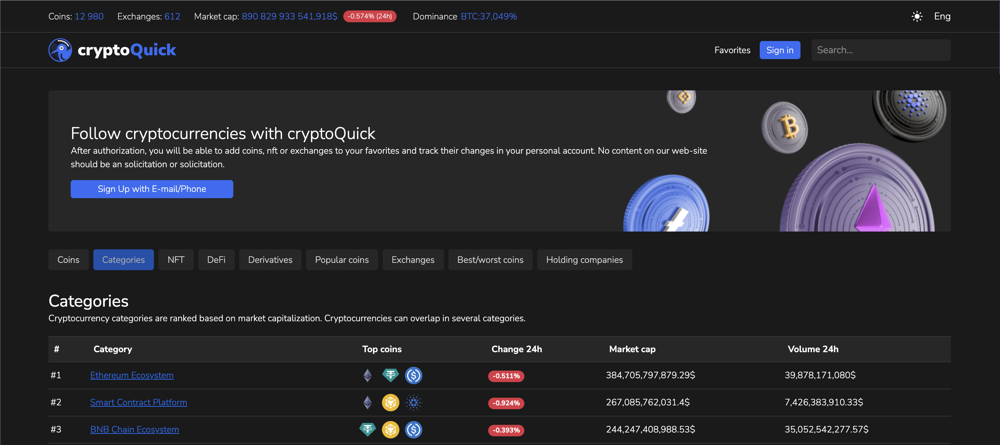

This project was created to get acquainted with information about cryptocurrencies, NFTs, exchanges and derivatives.
#### `Powered by CoinGecko.`

--------------------------------------------------------------------------------
This project was bootstrapped with [Create React App](https://github.com/facebook/create-react-app).

#### Available Scripts
In the project directory, you can run:
##### `npm start`
Launches the test runner in the interactive watch mode.\
See the section about [running tests](https://facebook.github.io/create-react-app/docs/running-tests) for more information.

##### `npm run build`

Builds the app for production to the `build` folder.\
It correctly bundles React in production mode and optimizes the build for the best performance.

The build is minified and the filenames include the hashes.\
Your app is ready to be deployed!

See the section about [deployment](https://facebook.github.io/create-react-app/docs/deployment) for more information.

## Screenshots:

